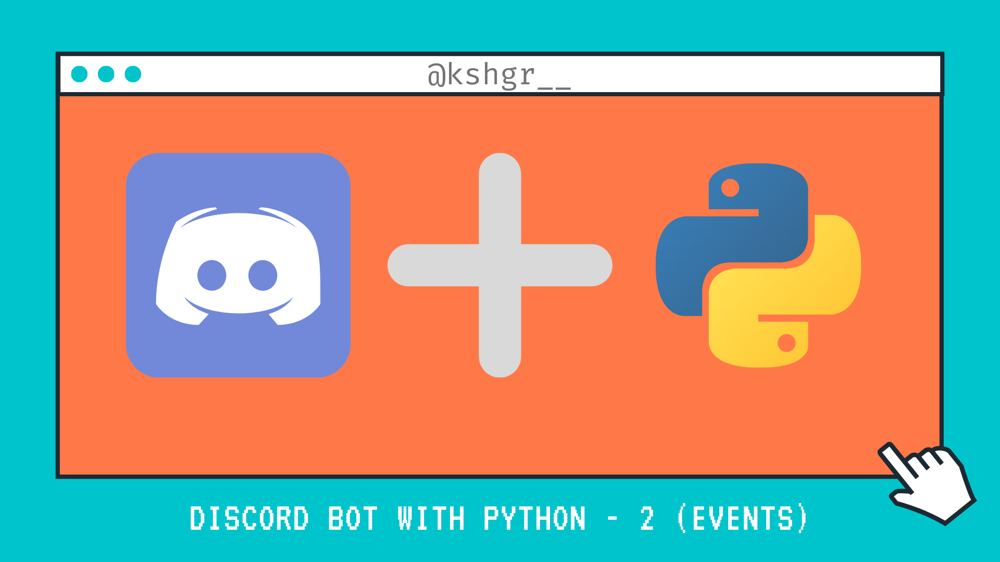

# Creating a Discord Bot with Python - 2 (Events)

This is the second part of the Discord Bot with Python tutorial series.
In this [video](https://youtu.be/pQk6Yvsv4YU), we go over the use of events with the Discord Bot.
[](https://youtu.be/pQk6Yvsv4YU)

## Installation

If you are using Repl.it, all packages imported are installed automatically.

Else if you are making the bot locally -
Use the package manager [pip](https://pip.pypa.io/en/stable/) to install discord.py.

```bash
pip install discord.py
```

## Usage
In [.env](.env)
```python
TOKEN={ENTER YOUR TOKEN}
```
* Send a message starting with 'hello' and the bot will respond with Hello There!
* When a message is deleted the bot tells what the message was and who was the author.


## Resources

[Repl.it](https://repl.it/@kshgr/Sage-Discord-Bot#main.py)
Online IDE used throughout project, direct link to project file.

[Discord.py Documentation](https://discordpy.readthedocs.io/en/latest/index.html)
Read the docs for better understanding of the code.

[Discord Developer](https://discord.com/developers/applications)
Create your very own Discord Bot here!

## License

[MIT](https://choosealicense.com/licenses/mit/)
